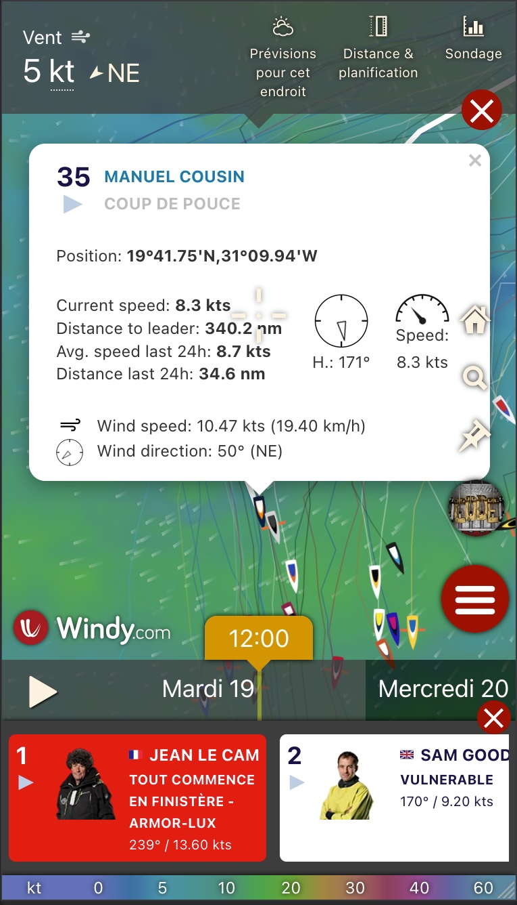

# Windy Plugin VG 2024

Windy Plugin for Vendee Globe 2024 Tracking

## Getting Started

Install dependencies:

```bash
npm install
```

If you need to sync data from FTP, create `.env` file and set credentials:

```bash
cp .env.example .env
```

## Sync Data

Get last reports from FTP server:

```bash
npm run sync:ftp
```

Sync main data file:

```bash
npm run sync:data
```

## Run Plugin

Update sources:

```bash
git pull
```

Run plugin locally:

```bash
npm run start
```

Visit: https://localhost:9999/plugin.js<br />
And accept the self-signed certificate.

Visit: https://www.windy.com/developer-mode<br />
And click on `Install & open plugin`

Now the boat tracking should appear with up-to-date data

## Screenshots

_Desktop (fr)_


_Mobile (en)_
<br />


## To do

-   Add exclusion zones
-   Add waves data
-   <s>Mobile UI</s>
